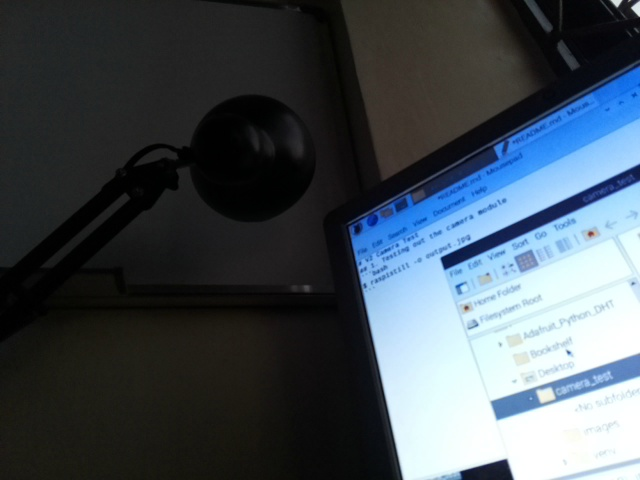
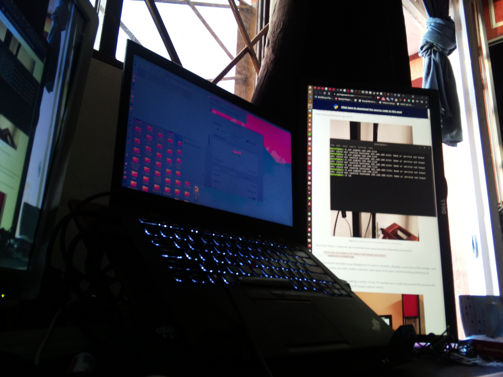
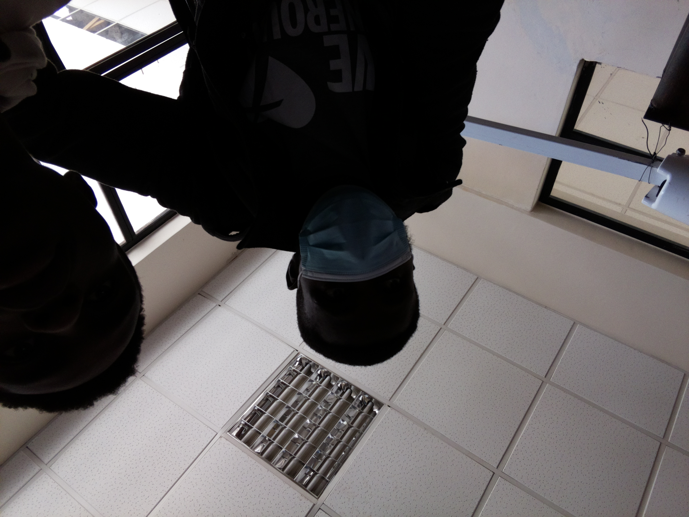

# Raspberry pi V2 Camera Test
## Hardware
1. Raspberry pi 3 model B
2. Raspberry pi Camera v2 8mp

## 1. Testing out the camera module
Connect the camera correctly and enable the camera interface on the raspberry pi configuration. [Raspberry pi tutorial](https://projects.raspberrypi.org/en/projects/getting-started-with-picamera) on this.
```bash
$ raspistill -o images/output.jpg
```
## 2. Clone the repository
```bash
$ git clone git@github.com:DanNduati/raspberry_pi_camera_tests.git 
```
## 3. Create python virtual environment and activate it
```bash
$ python3 -m venv venv
$ source venv/bin/activate
```
## Install the dependencies
```bash
$ pip install -r requirements.txt
```
## Install opencv dependencies
To make opencv installation less hectic i've create a bashscript that automates opencv dependency installation so just run it:
```bash
$ chmod +x cv_install.sh
$ ./cv_install.sh
```
## Sample photos
</img>
</img>
</img>
